# 🚗 PrawkoAi

> AI-powered mobile application for driving license exam preparation in Poland 🇵🇱

PrawkoAi is a mobile application created to help users prepare for driving license examinations in Poland.  
The project combines official driving exam questions with 🤖 AI-powered assistance, 📊 progress tracking, and 📝 realistic exam simulations.

Originally, the project was planned as a **SaaS platform** for commercial use. Unfortunately, commercial rights for the official driving exam questions and multimedia materials were not obtained, therefore the project remains a **non-commercial educational and portfolio application**.

---

# ✨ Features

## 📚 Learning System

- 🚘 **Driving License Question Bank** – access to official driving exam questions.
- 📝 **Exam Simulations** – realistic timed exams similar to the official state exam.
- 📈 **Progress Tracking** – monitor mistakes, weak areas, and exam history.
- 🌍 **Localization Support** – multilingual support using internationalization tools.

---

## 🤖 AI Features

Integrated AI functionalities include:

- 🌐 Translating questions and explanations into multiple languages.
- 🧠 Generating personalized preparation reports.
- 📊 Detecting weak knowledge areas.
- 🎯 Suggesting what the user should focus on before the exam.

AI services are powered using **Google Gemini API**.

---

## 🔐 Authentication & Infrastructure

Authentication supports:

- 📱 **Unique Device ID Authentication**
  - users can use the application anonymously with sessions linked to their device.
- 🔑 **Google OAuth Authentication**
  - login and registration using Google accounts.

Backend infrastructure:

- 🐘 **PostgreSQL**
  - used for storing users, questions, answers, exams, and statistics.
- ⚡ **Redis**
  - used for caching and improving backend performance.
- 🔒 **JWT Authentication**
  - secure access token and refresh token system.

---

## 📱 UI Preview & Screenshots

### 🔑 Core Navigation & Search
<p align="center">
  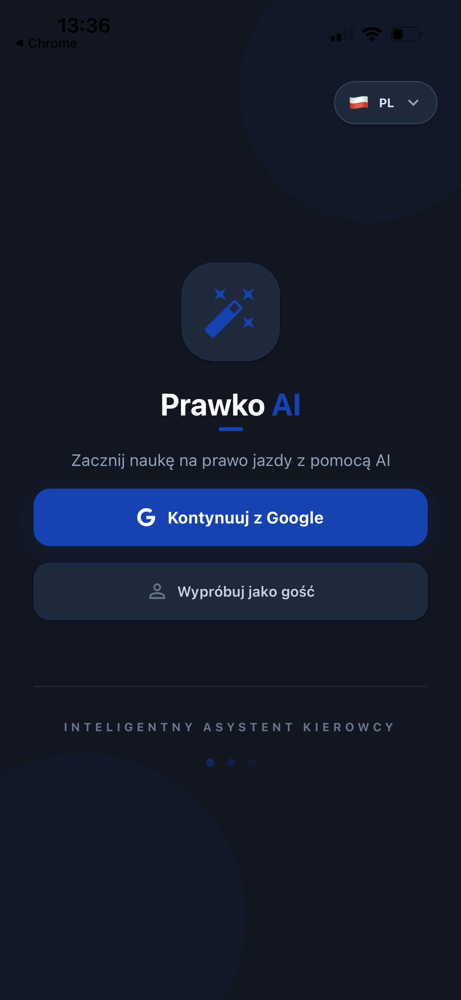
  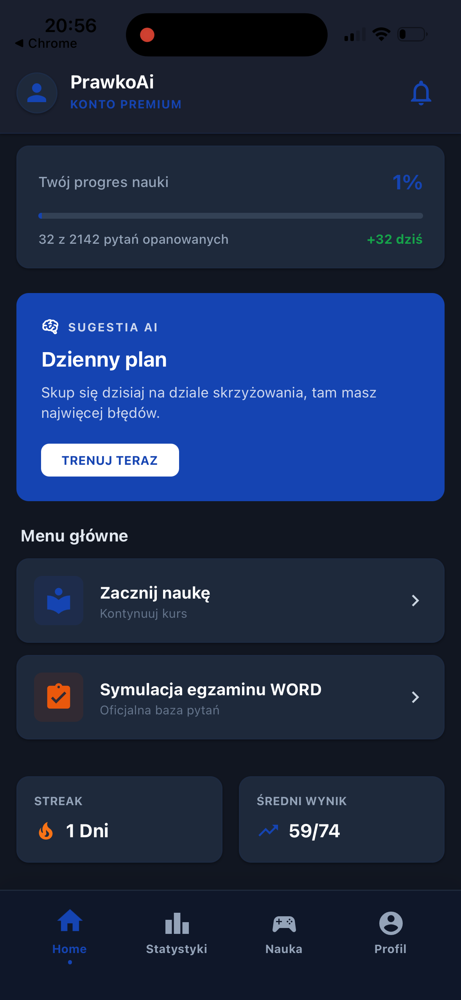
  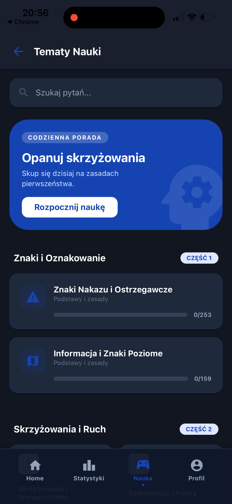
  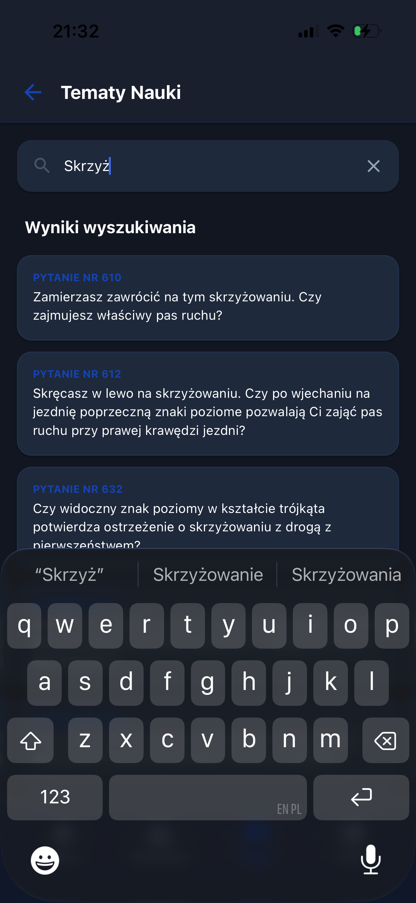
  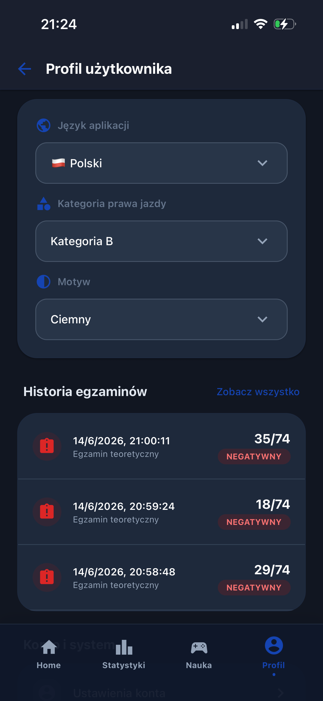
  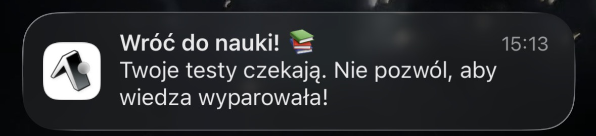
</p>

### 📝 Learning Paths & Exam Simulation
<p align="center">
  
  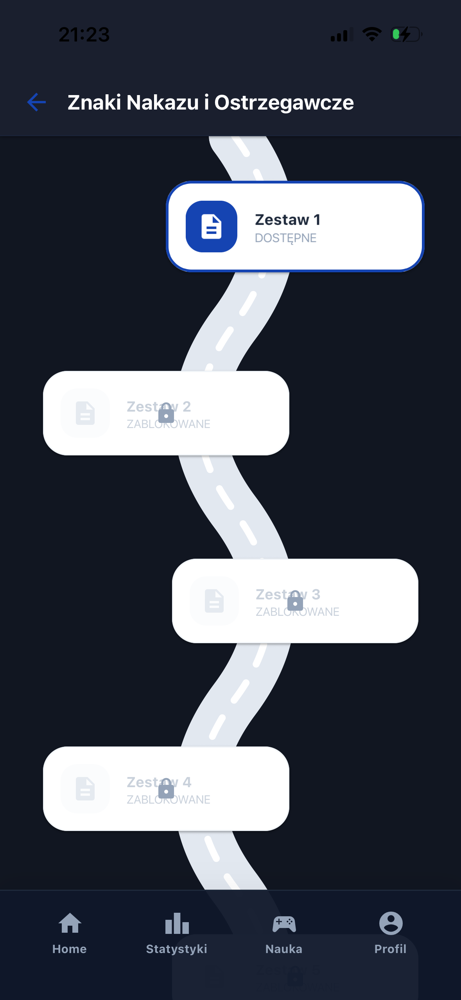
  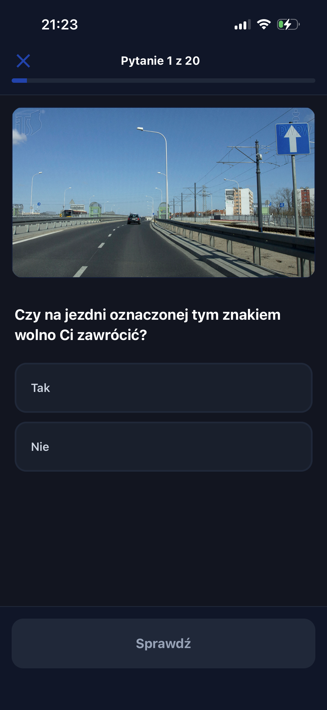
  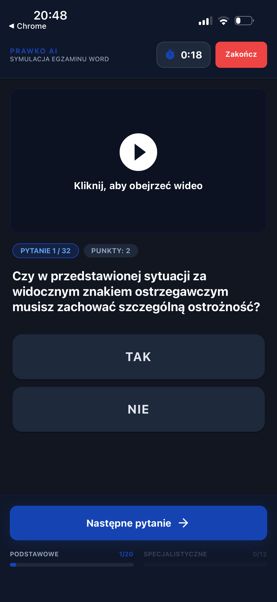
  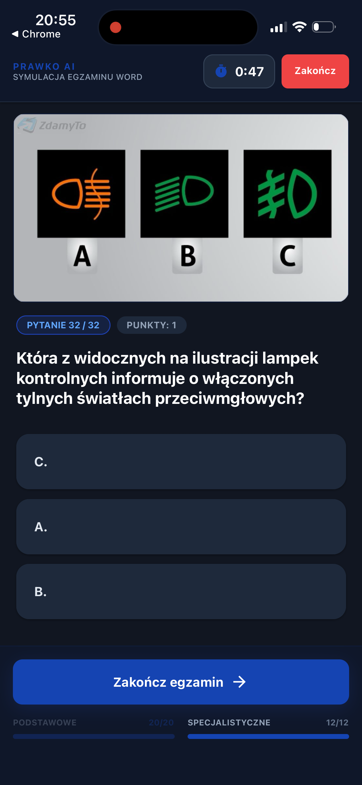
  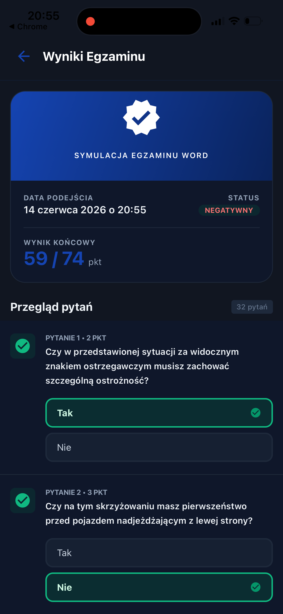
</p>

### 📊 AI Analytics & Statistics
<p align="center">
  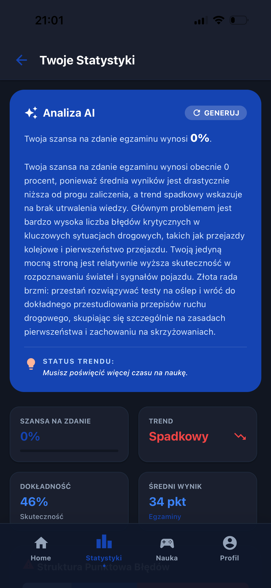
  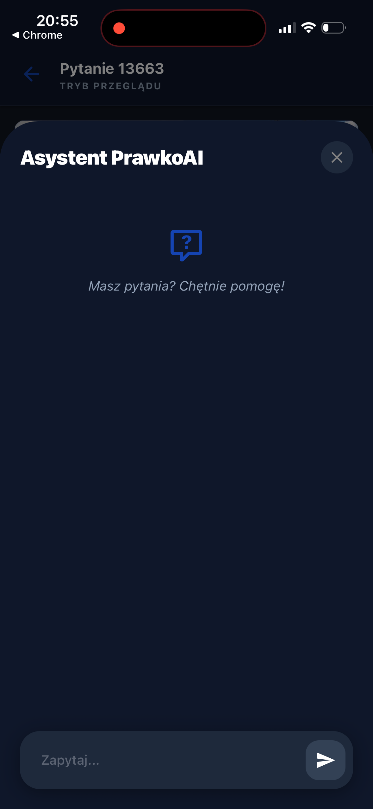
  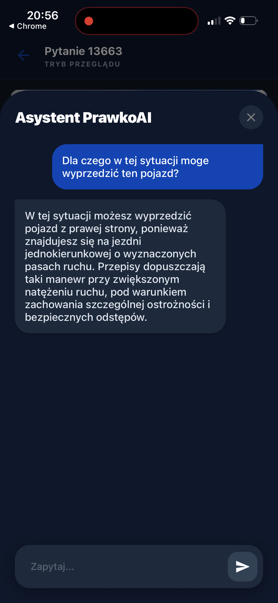
  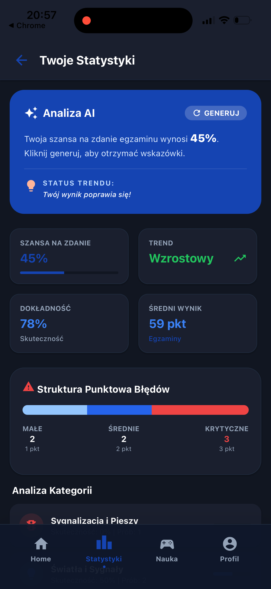
  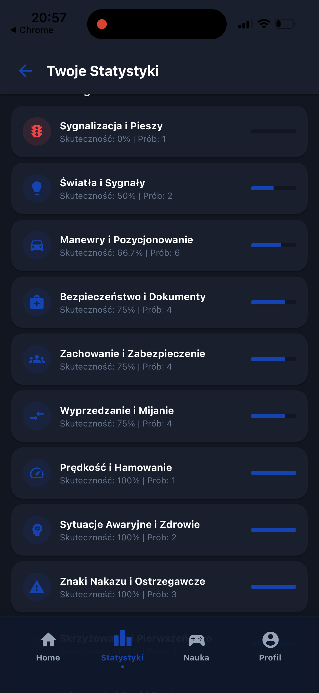
</p>

---

## 🛠️ App Navigation

1.  **Home** — Dashboard, AI recommendations, and streaks.
2.  **Stats** — Deep analytics, mistake distribution, and AI insights.
3.  **Learn** — Question search, categories, and roadmap paths.
4.  **Profile** — Account management and premium settings.

---

# 🛠️ Tech Stack

## 📱 Frontend

### Languages

- JavaScript
- TypeScript

### Technologies & Libraries

- ⚛️ React
- 📲 React Native
- 🚀 Expo
- 🔄 Axios
- 🎨 NativeWind (TailwindCSS)
- ✨ Moti Animations
- 🌐 i18n-js
- 🧭 React Navigation

### Storage & Security

- AsyncStorage
- Expo Secure Store
- JWT Decode

---

## 🖥️ Backend

### Languages

- C#
- Python

### Technologies

- .NET / ASP.NET Core
- PostgreSQL
- Redis
- JWT Authentication
- Google OAuth

### AI Services

- Gemini API integration for generating AI reports and analytics.

---

# 📦 Official Multimedia Requirement

⚠️ The application requires official multimedia files provided by the Polish Ministry of Infrastructure.

Without these resources, many questions containing 🎥 videos and 🖼️ images will not work properly.

## Official Download Source

https://www.gov.pl/web/infrastruktura/prawo-jazdy

---

# 🐳 Docker Support

Backend project can be started using Docker and Docker Compose.

## Docker Prerequisites

- Docker
- Docker desktop

## Start services:

```bash
docker compose up -d
```

---

# 📄 .env.example

Create a `.env` file based on the following template:

```env
#DB PARAMS

DB_DATABASE=DB_NAME
DB_USER=DB_USERNAME
DB_PASSWORD=DB_PASSWORD

#CONNECTION STRINGS

CONNECTION_REDIS=REDIS_CONNECTION

#JWT PARAMS

JWT_SECRET=JWT_SECRET
JWT_ISSUER=JWT_ISSUER
JWT_AUDIENCE=JWT_AUDIENCE
JWT_ACCESS_TOKEN_EXPIRATION=ACCESS_TOKEN_EXPIRATION_IN_MINUTES
JWT_REFRESH_TOKEN_EXPIRATION=REFRESH_TOKEN_EXPIRATION_IN_DAYS

#AI PRAMS

AI_MODEL_STREAM_URL=AI_MODEL_URL
AI_MODEL_GENERATE_URL=AI_MODEL_URL_WITH_STREAM_ABILITY
AI_API_KEY=YOUR_API_KEY
AI_ANWER_COUNT=NUMBER_OF_ANSWERS_TAKEN_TO_ANALITYCS
AI_EXAM_COUNT=NUMBER_OF_EXAMS_TAKEN_TO_ANALITYCS

#GOOGLE AUTH PARAMS

GOOGLE_AUTH_CLIENT_ID=YOUR_CLIENT_ID
GOOGLE_AUTH_SECRET=YOUR_SECRET
```

# 🚀 Installation Guide

## ✅ Prerequisites

Before starting, install:

- Node.js
- npm / yarn
- Expo CLI
- .NET SDK
- PostgreSQL
- Redis
- Python
- cloudflared

---

# 📲 Client Installation (Expo)

## 1️⃣ Clone Repository

```bash
git clone https://github.com/your-username/PrawkoAi.git
cd PrawkoAi
```

---

## 2️⃣ Install Dependencies

```bash
npm install
```

or

```bash
yarn install
```

---

# 🎥 Multimedia Server Setup

The downloaded multimedia package must be hosted locally.

Run:

```bash
npx http-server D:\multimedia_do_pytan_expo -p 8080 --cors
```

Expose multimedia using Cloudflare Tunnel:

```bash
cloudflared tunnel --url http://localhost:8080
```

Expose backend API:

```bash
cloudflared tunnel --url https://localhost:7259
```

After running these commands, Cloudflare will generate public URLs.

---

# ⚙️ Expo Environment Variables

Generated Cloudflare URLs must be added to the Expo `.env` file:

```env
EXPO_PUBLIC_API_URL=https://your-generated-api-url.trycloudflare.com

EXPO_PUBLIC_SUPABASE_BUCKET_URL=https://your-generated-media-url.trycloudflare.com
```

---

# 🧩 Backend Configuration

The `appsettings.json` file must be filled with your own credentials and configuration values.

## Example Configuration

```json
{
  "Logging": {
    "LogLevel": {
      "Default": "Information",
      "Microsoft.AspNetCore": "Warning"
    }
  },
  "ConnectionStrings": {
    "DatabaseConnectionString": "Host=127.0.0.1;Port=5432;Password=YOUR_PASSWORD;Persist Security Info=True;Username=postgres;Database=prawko_db",
    "RedisConnection": "localhost:6379"
  },
  "Jwt": {
    "Issuer": "http://localhost:8081/",
    "Audience": "http://localhost:8081/",
    "Secret": "YOUR_SECRET",
    "JwtExpirationInMinutes": 151231312,
    "RefreshTokenExpirationTimeInDays": 30
  },
  "AI": {
    "GeminiApiKey": "YOUR_GEMINI_API_KEY",
    "AnswersCount": 500,
    "ExamCount": 10,
    "ModelGenerateUrl": "AI_MODEL_URL",
    "ModelStreamUrl": "AI_MODEL_URL_WITH_STREAM_ABILITY"
  },
  "GoogleAuth": {
    "ClientId": "YOUR_GOOGLE_CLIENT_ID",
    "ClientSecret": "YOUR_GOOGLE_CLIENT_SECRET"
  }
}
```


# ▶️ Running Backend

Restore packages:

```bash
dotnet restore
```

Build project:

```bash
dotnet build
```

Run backend:

```bash
dotnet run
```

---

# 📱 Running Expo Application

Start Expo:

```bash
npx expo start
```

Then launch the application using:

- 📲 Expo Go
- 🤖 Android Emulator
- 🍎 iOS Simulator

---

# 🧪 Usage Flow

1️⃣ Download official multimedia package.  
2️⃣ Configure PostgreSQL and Redis.  
3️⃣ Configure `.env` and `appsettings.json`.  
4️⃣ Start multimedia server and Cloudflare tunnels.  
5️⃣ Run backend services.  
6️⃣ Launch Expo application.  
7️⃣ Authenticate using:

- 📱 Device ID
- 🔑 Google Account
  8️⃣ Start solving questions and exams.  
  9️⃣ Receive 🤖 AI-generated preparation reports and analytics.

---

# 📄 License

This project is intended for:

- 🎓 Educational purposes
- 💼 Portfolio presentation
- 🧪 Learning & experimentation

Commercial usage is not permitted due to licensing limitations related to official exam content and multimedia assets.